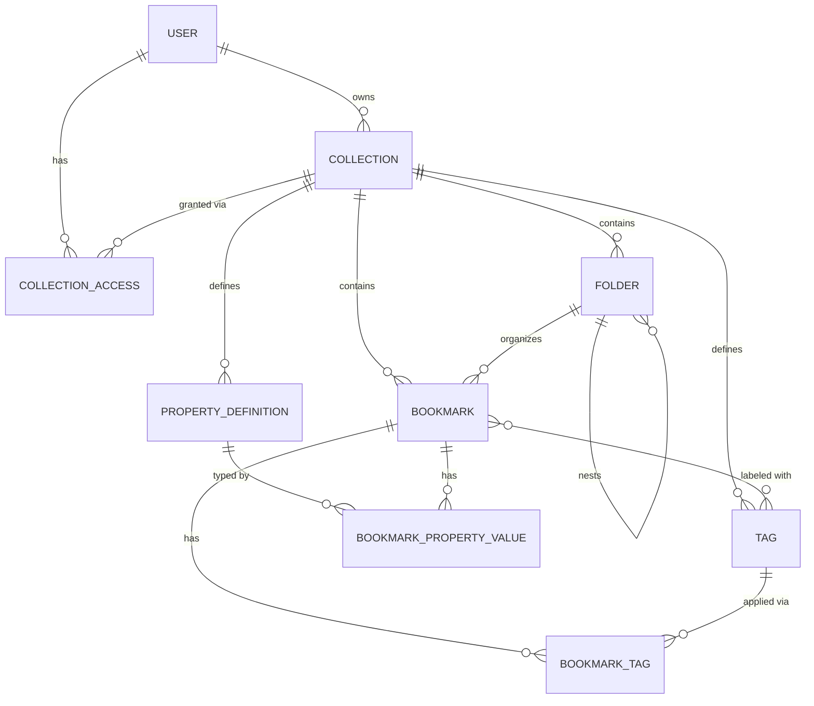

# Entity Model

**Project:** Chainlink Bookmark Manager
**Source:** [requirements.md](requirements.md)
**Date:** 2026-03-26

---

## Entity Relationship Diagram

---

### USER

Represents an authenticated user identified by a unique username.

| Attribute  | Description                       | Data Type | Length/Precision | Validation Rules      |
|------------|-----------------------------------|-----------|------------------|-----------------------|
| id         | Unique identifier                 | UUID      | 36               | Primary Key, Server-assigned |
| username   | Stable unique identity of the user | String   | 100              | Not Null, Unique      |
| created_at | Timestamp when the user was first seen | DateTime | -            | Not Null              |

---

### COLLECTION

A named collection of bookmarks owned by a user.

| Attribute  | Description                        | Data Type | Length/Precision | Validation Rules              |
|------------|------------------------------------|-----------|------------------|-------------------------------|
| id         | Unique identifier                  | UUID      | 36               | Primary Key, Server-assigned  |
| name       | Display name of the collection     | String    | 100              | Not Null                      |
| owner_id   | Reference to the user who created the collection | UUID | 36        | Not Null, Foreign Key (USER.id) |
| created_at | Timestamp when the collection was created | DateTime | -            | Not Null                      |

---

### COLLECTION_ACCESS

Controls which users can access which collections and tracks the default collection per user.

| Attribute  | Description                                      | Data Type | Length/Precision | Validation Rules                  |
|------------|--------------------------------------------------|-----------|------------------|-----------------------------------|
| id         | Unique identifier                                | UUID      | 36               | Primary Key, Server-assigned      |
| collection_id | Reference to the collection                     | UUID      | 36               | Not Null, Foreign Key (COLLECTION.id) |
| user_id    | Reference to the user                            | UUID      | 36               | Not Null, Foreign Key (USER.id)   |
| role       | Access role of the user in the collection        | String    | 10               | Not Null, Values: owner, member   |
| is_default | Marks this as the user's default collection      | Boolean   | 1                | Not Null                          |

**Constraints:**
- The combination of `collection_id` and `user_id` must be unique.
- Exactly one row per `user_id` must have `is_default = true` at all times. A user without a default collection is invalid.

---

### BOOKMARK

A saved web resource with a URL and title, belonging to a collection.

| Attribute   | Description                                  | Data Type | Length/Precision | Validation Rules                   |
|-------------|----------------------------------------------|-----------|------------------|------------------------------------|
| id          | Unique identifier                            | UUID      | 36               | Primary Key, Server-assigned       |
| collection_id  | Reference to the owning collection        | UUID      | 36               | Not Null, Foreign Key (COLLECTION.id) |
| folder_id   | Reference to the containing folder           | UUID      | 36               | Optional, Foreign Key (FOLDER.id)  |
| url         | The saved URL                                | String    | 2048             | Not Null                           |
| title       | Display title of the bookmark                | String    | 255              | Not Null                           |
| description | Optional free-text description               | String    | 1000             | Optional                           |
| created_at  | Timestamp when the bookmark was created      | DateTime  | -                | Not Null                           |
| updated_at  | Timestamp of the last update                 | DateTime  | -                | Not Null                           |

**Constraints:** `folder_id`, when set, must reference a folder belonging to the same `collection_id`.

---

### FOLDER

An organizational container for bookmarks within a collection, supporting nesting.

| Attribute  | Description                                   | Data Type | Length/Precision | Validation Rules                   |
|------------|-----------------------------------------------|-----------|------------------|------------------------------------|
| id         | Unique identifier                             | UUID      | 36               | Primary Key, Server-assigned       |
| collection_id | Reference to the owning collection         | UUID      | 36               | Not Null, Foreign Key (COLLECTION.id) |
| parent_id  | Reference to the parent folder (null = root)  | UUID      | 36               | Optional, Foreign Key (FOLDER.id)  |
| name       | Display name of the folder                    | String    | 100              | Not Null                           |
| created_at | Timestamp when the folder was created         | DateTime  | -                | Not Null                           |

**Constraints:** `parent_id`, when set, must reference a folder belonging to the same `collection_id`.

---

### TAG

A user-defined label scoped to a collection, applied to bookmarks for categorization.

| Attribute  | Description                           | Data Type | Length/Precision | Validation Rules                   |
|------------|---------------------------------------|-----------|------------------|------------------------------------|
| id         | Unique identifier                     | UUID      | 36               | Primary Key, Server-assigned       |
| collection_id | Reference to the owning collection | UUID      | 36               | Not Null, Foreign Key (COLLECTION.id) |
| name       | Display name of the tag               | String    | 50               | Not Null                           |
| color      | Hex color code for display            | String    | 7                | Not Null, Default: auto-assigned   |
| created_at | Timestamp when the tag was created    | DateTime  | -                | Not Null                           |

**Constraints:** `name` must be unique within a `collection_id`.

---

### BOOKMARK_TAG

Junction table linking bookmarks to their applied tags (many-to-many).

| Attribute   | Description                     | Data Type | Length/Precision | Validation Rules                    |
|-------------|---------------------------------|-----------|------------------|-------------------------------------|
| bookmark_id | Reference to the bookmark       | UUID      | 36               | Not Null, Foreign Key (BOOKMARK.id) |
| tag_id      | Reference to the tag            | UUID      | 36               | Not Null, Foreign Key (TAG.id)      |

**Constraints:**
- Composite primary key: (`bookmark_id`, `tag_id`).
- `bookmark_id` and `tag_id` must belong to the same `collection_id`.

---

### PROPERTY_DEFINITION

Defines a typed, named property schema at the collection level that bookmarks can carry values for.

| Attribute      | Description                                       | Data Type | Length/Precision | Validation Rules                                           |
|----------------|---------------------------------------------------|-----------|------------------|------------------------------------------------------------|
| id             | Unique identifier                                 | UUID      | 36               | Primary Key, Server-assigned                               |
| collection_id  | Reference to the owning collection                | UUID      | 36               | Not Null, Foreign Key (COLLECTION.id)                      |
| name           | Display name of the property                      | String    | 255              | Not Null                                                   |
| type           | Value type (TEXT, DATE, SELECT, MULTI_SELECT, BOOLEAN, NUMBER) | String | 30 | Not Null, Values: TEXT, DATE, SELECT, MULTI_SELECT, BOOLEAN, NUMBER |
| allowed_values | Comma-separated list of allowed values for SELECT/MULTI_SELECT types | String | 2000 | Optional |
| sort_order     | Display order among properties in the collection   | Integer   | 10               | Not Null                                                   |
| created_at     | Timestamp when the property definition was created | DateTime  | -                | Not Null                                                   |

**Constraints:** `name` must be unique within a `collection_id`.

---

### BOOKMARK_PROPERTY_VALUE

Stores a single typed value linking a bookmark to a property definition. Multiple rows per bookmark are allowed (one per definition; multiple for MULTI_SELECT).

| Attribute          | Description                                      | Data Type | Length/Precision | Validation Rules                                |
|--------------------|--------------------------------------------------|-----------|------------------|-------------------------------------------------|
| id                 | Unique identifier                                | UUID      | 36               | Primary Key, Server-assigned                    |
| bookmark_id        | Reference to the bookmark                        | UUID      | 36               | Not Null, Foreign Key (BOOKMARK.id)             |
| property_definition_id | Reference to the property definition         | UUID      | 36               | Not Null, Foreign Key (PROPERTY_DEFINITION.id)  |
| value_text         | Text, date (ISO-8601), or select option value    | String    | 255              | Optional                                        |
| value_number       | Numeric value for NUMBER type                    | Decimal   | 19,2             | Optional                                        |
| value_boolean      | Boolean value for BOOLEAN type                   | Boolean   | 1                | Optional                                        |

**Constraints:**
- For non-MULTI_SELECT types, the combination of (`bookmark_id`, `property_definition_id`) must be unique.
- `bookmark_id` and `property_definition_id` must belong to the same `collection_id`.
- Only one of `value_text`, `value_number`, `value_boolean` should be non-null, determined by the definition's `type`.

---

> **Auditing:** Change history for BOOKMARK, FOLDER, TAG, PROPERTY_DEFINITION, and BOOKMARK_PROPERTY_VALUE is managed automatically by Hibernate Envers.
> No custom AUDIT_LOG entity is modeled; Envers generates revision tables at the schema level.
