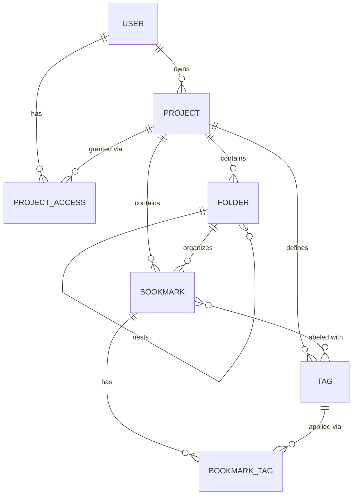

# Entity Model

**Project:** Chainlink Bookmark Manager
**Source:** [requirements.md](requirements.md)
**Date:** 2026-03-26

---

## Entity Relationship Diagram

---

### USER

Represents an authenticated user identified by a unique username.

| Attribute  | Description                       | Data Type | Length/Precision | Validation Rules      |
|------------|-----------------------------------|-----------|------------------|-----------------------|
| id         | Unique identifier                 | UUID      | 36               | Primary Key, Server-assigned |
| username   | Stable unique identity of the user | String   | 100              | Not Null, Unique      |
| created_at | Timestamp when the user was first seen | DateTime | -            | Not Null              |

---

### PROJECT

A named collection of bookmarks owned by a user.

| Attribute  | Description                        | Data Type | Length/Precision | Validation Rules              |
|------------|------------------------------------|-----------|------------------|-------------------------------|
| id         | Unique identifier                  | UUID      | 36               | Primary Key, Server-assigned  |
| name       | Display name of the project        | String    | 100              | Not Null                      |
| owner_id   | Reference to the user who created the project | UUID | 36        | Not Null, Foreign Key (USER.id) |
| created_at | Timestamp when the project was created | DateTime | -            | Not Null                      |

---

### PROJECT_ACCESS

Controls which users can access which projects and tracks the default project per user.

| Attribute  | Description                                      | Data Type | Length/Precision | Validation Rules                  |
|------------|--------------------------------------------------|-----------|------------------|-----------------------------------|
| id         | Unique identifier                                | UUID      | 36               | Primary Key, Server-assigned      |
| project_id | Reference to the project                         | UUID      | 36               | Not Null, Foreign Key (PROJECT.id) |
| user_id    | Reference to the user                            | UUID      | 36               | Not Null, Foreign Key (USER.id)   |
| role       | Access role of the user in the project           | String    | 10               | Not Null, Values: owner, member   |
| is_default | Marks this as the user's default project         | Boolean   | 1                | Not Null                          |

**Constraints:**
- The combination of `project_id` and `user_id` must be unique.
- At most one row per `user_id` may have `is_default = true`.

---

### BOOKMARK

A saved web resource with a URL and title, belonging to a project.

| Attribute   | Description                                  | Data Type | Length/Precision | Validation Rules                   |
|-------------|----------------------------------------------|-----------|------------------|------------------------------------|
| id          | Unique identifier                            | UUID      | 36               | Primary Key, Server-assigned       |
| project_id  | Reference to the owning project              | UUID      | 36               | Not Null, Foreign Key (PROJECT.id) |
| folder_id   | Reference to the containing folder           | UUID      | 36               | Optional, Foreign Key (FOLDER.id)  |
| url         | The saved URL                                | String    | 2048             | Not Null                           |
| title       | Display title of the bookmark                | String    | 255              | Not Null                           |
| description | Optional free-text description               | String    | 1000             | Optional                           |
| created_at  | Timestamp when the bookmark was created      | DateTime  | -                | Not Null                           |
| updated_at  | Timestamp of the last update                 | DateTime  | -                | Not Null                           |

**Constraints:** `folder_id`, when set, must reference a folder belonging to the same `project_id`.

---

### FOLDER

An organizational container for bookmarks within a project, supporting nesting.

| Attribute  | Description                                   | Data Type | Length/Precision | Validation Rules                   |
|------------|-----------------------------------------------|-----------|------------------|------------------------------------|
| id         | Unique identifier                             | UUID      | 36               | Primary Key, Server-assigned       |
| project_id | Reference to the owning project               | UUID      | 36               | Not Null, Foreign Key (PROJECT.id) |
| parent_id  | Reference to the parent folder (null = root)  | UUID      | 36               | Optional, Foreign Key (FOLDER.id)  |
| name       | Display name of the folder                    | String    | 100              | Not Null                           |
| created_at | Timestamp when the folder was created         | DateTime  | -                | Not Null                           |

**Constraints:** `parent_id`, when set, must reference a folder belonging to the same `project_id`.

---

### TAG

A user-defined label scoped to a project, applied to bookmarks for categorization.

| Attribute  | Description                           | Data Type | Length/Precision | Validation Rules                   |
|------------|---------------------------------------|-----------|------------------|------------------------------------|
| id         | Unique identifier                     | UUID      | 36               | Primary Key, Server-assigned       |
| project_id | Reference to the owning project       | UUID      | 36               | Not Null, Foreign Key (PROJECT.id) |
| name       | Display name of the tag               | String    | 50               | Not Null                           |
| created_at | Timestamp when the tag was created    | DateTime  | -                | Not Null                           |

**Constraints:** `name` must be unique within a `project_id`.

---

### BOOKMARK_TAG

Junction table linking bookmarks to their applied tags (many-to-many).

| Attribute   | Description                     | Data Type | Length/Precision | Validation Rules                    |
|-------------|---------------------------------|-----------|------------------|-------------------------------------|
| bookmark_id | Reference to the bookmark       | UUID      | 36               | Not Null, Foreign Key (BOOKMARK.id) |
| tag_id      | Reference to the tag            | UUID      | 36               | Not Null, Foreign Key (TAG.id)      |

**Constraints:**
- Composite primary key: (`bookmark_id`, `tag_id`).
- `bookmark_id` and `tag_id` must belong to the same `project_id`.

---

> **Auditing:** Change history for BOOKMARK, FOLDER, and TAG is managed automatically by Hibernate Envers.
> No custom AUDIT_LOG entity is modeled; Envers generates revision tables at the schema level.
