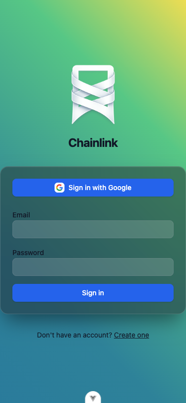
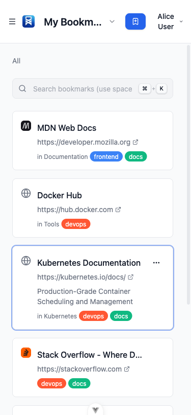
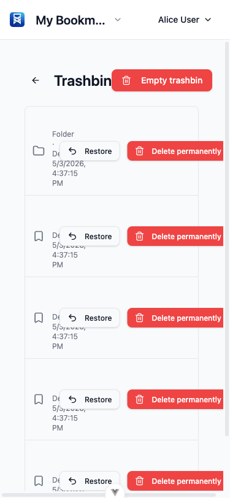
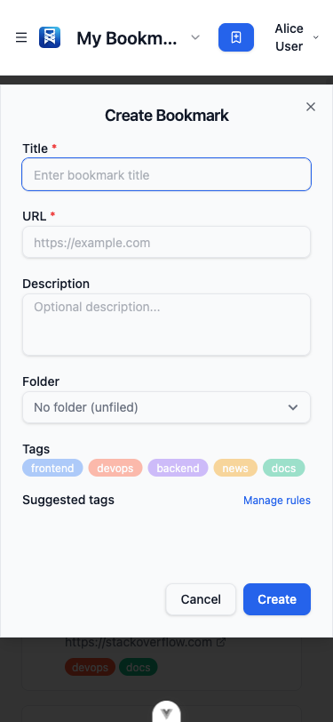
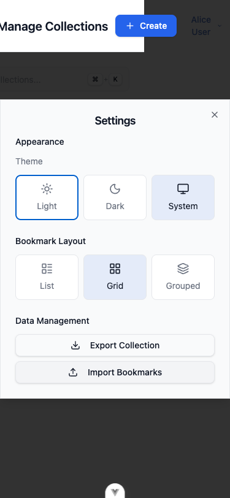
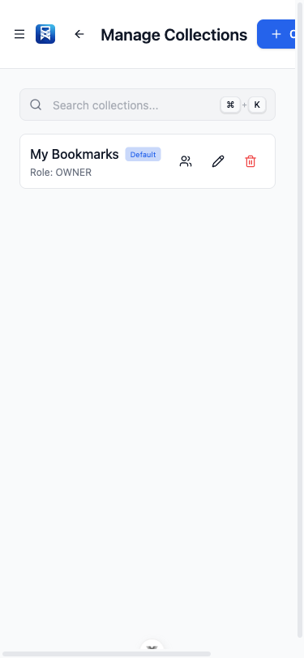
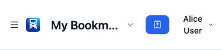

# Mobile Viability Review — Chainlink Frontend

**Date:** 2026-05-03  
**Viewport:** 375×812 (iPhone SE / standard mobile width)  
**Scope:** All Vue components in `frontend/src/`  
**Status:** Before — known issues documented with screenshots  

---

## Table of Contents

1. [What's Already Working](#1-whats-already-working)
2. [Critical Issues](#2-critical-issues)
   - [2.1 Trashbin: Action Buttons Overflow](#21-trashbin-action-buttons-overflow)
   - [2.2 Dialogs: Content Overflows Viewport](#22-dialogs-content-overflows-viewport)
   - [2.3 Collection Management: Row Actions Overflow](#23-collection-management-row-actions-overflow)
   - [2.4 Share Collection Dialog: Invite Form Breaks](#24-share-collection-dialog-invite-form-breaks)
3. [Important Issues](#3-important-issues)
   - [3.1 Touch Targets Too Small](#31-touch-targets-too-small)
   - [3.2 Main Content Padding Too Generous](#32-main-content-padding-too-generous)
   - [3.3 Header Horizontal Space Competition](#33-header-horizontal-space-competition)
   - [3.4 Drag-and-Drop Non-Functional on Touch](#34-drag-and-drop-non-functional-on-touch)
   - [3.5 Sidebar Context Menu Buttons Too Small](#35-sidebar-context-menu-buttons-too-small)
4. [Implementation Plan](#4-implementation-plan)

---

## 1. What's Already Working

The app has several mobile-friendly patterns already in place:

| Feature | Implementation |
|---------|---------------|
| Viewport meta tag | `<meta name="viewport" content="width=device-width, initial-scale=1.0">` in `index.html` |
| Mobile sidebar drawer | Hamburger menu toggle, overlay backdrop, slide-in animation |
| Responsive breakpoints | `sm:`, `lg:` Tailwind prefixes used throughout |
| Auth pages | `max-w-sm` containers work well on mobile |
| Collection switcher | Responsive truncation: `max-w-[120px]` on mobile → `sm:max-w-[200px]` → `md:max-w-[300px]` |
| Add Bookmark button | Hides label on small screens: `hidden sm:inline` |
| Breadcrumbs | Compact "All" label on mobile: `sm:hidden` / `hidden sm:inline` |

**Screenshots — working patterns:**

| | |
|---|---|
| Login page (responsive) |  |
| Main view with sidebar closed |  |
| Sidebar drawer open |  |

---

## 2. Critical Issues

### 2.1 Trashbin: Action Buttons Overflow

**Severity:** 🔴 Critical  
**Confidence:** 95  
**Files:** `frontend/src/views/TrashbinView.vue`  
**Screenshot:** 

#### Problem

Each trashbin row contains:
- Icon + truncated title + metadata text
- "Restore" button with icon + text
- "Delete Permanently" button with icon + text

On a 375px-wide screen, these two full-text buttons compete with the content for horizontal space. With long titles (e.g., "Stack Overflow - Where Developers Learn, Share, & Build Careers"), the content area is squeezed to near-zero width or the buttons overflow the viewport.

#### Code

```vue
<!-- TrashbinView.vue — each list item -->
<li class="flex items-center gap-3 p-3">
  <BookmarkIcon class="h-5 w-5 shrink-0 text-muted-foreground" />
  <div class="min-w-0 flex-1">
    <!-- title + url + date -->
  </div>
  <!-- These two buttons don't fit side-by-side with the content on 375px -->
  <ButtonCl variant="outline" size="sm">
    <Undo2 class="mr-1 h-4 w-4" />
    {{ $t('trashbin.restore') }}
  </ButtonCl>
  <ButtonCl variant="destructive" size="sm">
    <Trash2 class="mr-1 h-4 w-4" />
    {{ $t('trashbin.deletePermanently') }}
  </ButtonCl>
</li>
```

#### Fix

Show icon-only buttons on mobile, full labels on `sm+`:

```vue
<div class="flex items-center gap-2 shrink-0">
  <ButtonCl variant="outline" size="icon" class="sm:hidden" @click="...">
    <Undo2 class="h-4 w-4" />
  </ButtonCl>
  <ButtonCl variant="outline" size="sm" class="hidden sm:inline-flex" @click="...">
    <Undo2 class="mr-1 h-4 w-4" />
    {{ $t('trashbin.restore') }}
  </ButtonCl>
  <ButtonCl variant="destructive" size="icon" class="sm:hidden" @click="...">
    <Trash2 class="h-4 w-4" />
  </ButtonCl>
  <ButtonCl variant="destructive" size="sm" class="hidden sm:inline-flex" @click="...">
    <Trash2 class="mr-1 h-4 w-4" />
    {{ $t('trashbin.deletePermanently') }}
  </ButtonCl>
</div>
```

---

### 2.2 Dialogs: Content Overflows Viewport

**Severity:** 🔴 Critical  
**Confidence:** 95  
**Files:** `frontend/src/components/ui/DialogCl.vue`  
**Screenshots:**

| Dialog | Screenshot |
|--------|-----------|
| Create Bookmark |  |
| Settings |  |
| Share Collection |  |

#### Problem

The `DialogCl` component uses `max-w-lg` (512px) with centering via `top-1/2 -translate-y-1/2`, but has **no `max-height` constraint** and **no scroll behavior**. On mobile:

1. **Create/Edit Bookmark dialogs** are very tall: title + URL + description + folder select + tag list + suggested tags + buttons. Content extends below the viewport with no way to scroll.
2. **Share Collection dialog** with members list + invite form overflows.
3. **Settings dialog** with theme/layout selectors + data management buttons can push off-screen.

Users on mobile **cannot reach the action buttons** (Cancel/Save) in tall dialogs.

#### Code

```vue
<!-- DialogCl.vue -->
<DialogContent
  :class="cn(
    'fixed left-1/2 top-1/2 z-50 grid w-full max-w-lg -translate-x-1/2 -translate-y-1/2 gap-4 border bg-background p-6 shadow-lg ...',
    props.class
  )"
>
```

Notice: no `max-h-*`, no `overflow-y-auto`.

#### Fix

```vue
<DialogContent
  :class="cn(
    'fixed left-1/2 top-1/2 z-50 grid w-full max-w-lg max-h-[90dvh] -translate-x-1/2 -translate-y-1/2 gap-4 border bg-background p-4 sm:p-6 shadow-lg overflow-y-auto ...',
    props.class
  )"
>
```

Key changes:
- Add `max-h-[90dvh]` to cap height at 90% of dynamic viewport height
- Add `overflow-y-auto` to enable scrolling within the dialog
- Use `p-4 sm:p-6` to save horizontal space on mobile
- Consider `dvh` units for correct behavior with mobile browser chrome

---

### 2.3 Collection Management: Row Actions Overflow

**Severity:** 🔴 Critical  
**Confidence:** 92  
**Files:** `frontend/src/views/CollectionManageView.vue`  
**Screenshot:** 

#### Problem

Each collection row uses `flex items-center gap-3` containing:
- Collection name + "Default" badge + "Shared" badge
- 1–4 icon buttons (star, share, edit, delete)

On mobile, the icon buttons + name + badges compete for space. When a collection has all 4 action buttons visible (OWNER), there's very little room for the collection name, and the row becomes visually cluttered and hard to interact with.

#### Code

```vue
<div class="flex items-center gap-3 p-3 rounded-lg border ...">
  <div class="flex-1 min-w-0">
    <span class="font-medium truncate">{{ col.name }}</span>
    <span v-if="col.isDefault" class="...">Default</span>
    <span v-if="col.shared" class="...">Shared</span>
  </div>
  <!-- These icon buttons can be 4 wide on OWNER rows -->
  <div class="flex items-center gap-1 shrink-0">
    <ButtonCl variant="ghost" size="icon">...</ButtonCl>  <!-- Star -->
    <ButtonCl variant="ghost" size="icon">...</ButtonCl>  <!-- Share -->
    <ButtonCl variant="ghost" size="icon">...</ButtonCl>  <!-- Edit -->
    <ButtonCl variant="ghost" size="icon">...</ButtonCl>  <!-- Delete -->
  </div>
</div>
```

#### Fix

Use a dropdown overflow menu on mobile, full icon row on desktop:

```vue
<!-- Desktop: full button row -->
<div class="hidden sm:flex items-center gap-1 shrink-0">
  <ButtonCl ...>Star</ButtonCl>
  <ButtonCl ...>Share</ButtonCl>
  <ButtonCl ...>Edit</ButtonCl>
  <ButtonCl ...>Delete</ButtonCl>
</div>

<!-- Mobile: dropdown with all actions -->
<div class="sm:hidden">
  <DropdownMenu>
    <DropdownMenuTrigger as-child>
      <ButtonCl variant="ghost" size="icon"><MoreHorizontal /></ButtonCl>
    </DropdownMenuTrigger>
    <DropdownMenuContent>
      <DropdownMenuItem @select="handleSetDefault(col.id)">Set as Default</DropdownMenuItem>
      <DropdownMenuItem @select="openShare(col.id, col.name)">Share</DropdownMenuItem>
      <DropdownMenuItem @select="openEdit(col.id, col.name, true)">Edit</DropdownMenuItem>
      <DropdownMenuItem @select="openDelete(col.id, col.name)">Delete</DropdownMenuItem>
    </DropdownMenuContent>
  </DropdownMenu>
</div>
```

---

### 2.4 Share Collection Dialog: Invite Form Breaks

**Severity:** 🔴 Critical  
**Confidence:** 90  
**Files:** `frontend/src/components/collection/ShareCollectionDialog.vue`  
**Screenshot:** 

#### Problem

The invite form uses `flex gap-2 items-start` with the email input (`flex-1`) and the invite button side by side. The invite button has text + icon. On 375px, the button text forces the email input to be extremely narrow — too narrow to be usable.

Additionally, the member list rows have hover-reveal actions (`[@media(hover:hover)]:opacity-0`) that are always visible on mobile at tiny sizes, and the revoke button is only 28px (`h-7 w-7`).

#### Code

```vue
<form class="flex gap-2 items-start" @submit.prevent="handleInvite">
  <div class="flex-1">
    <FormFieldCl :label="..." :error="...">
      <input type="email" ... />
    </FormFieldCl>
  </div>
  <ButtonCl type="submit" class="mt-[1.625rem]" ...>
    <UserPlus class="h-4 w-4" />
    {{ t('collectionManage.shareInviteBtn') }}
  </ButtonCl>
</form>
```

#### Fix

Stack the form vertically on mobile:

```vue
<form class="flex flex-col sm:flex-row gap-2 items-stretch sm:items-start" @submit.prevent="handleInvite">
  <div class="flex-1">
    <FormFieldCl ...>
      <input ... />
    </FormFieldCl>
  </div>
  <ButtonCl type="submit" class="sm:mt-[1.625rem] w-full sm:w-auto" ...>
    <UserPlus class="h-4 w-4" />
    {{ t('collectionManage.shareInviteBtn') }}
  </ButtonCl>
</form>
```

Also increase the revoke button touch target from `h-7 w-7` to `h-8 w-8` minimum, and ensure member role badges are always visible (not hover-dependent) on mobile.

---

## 3. Important Issues

### 3.1 Touch Targets Too Small

**Severity:** 🟡 Important  
**Confidence:** 88  
**Files:** `BookmarkCard.vue`, `BookmarkGroupedLayout.vue`, `FolderTreeNode.vue`  
**Screenshot:** 

#### Problem

Multiple interactive elements are below the recommended 44×44px minimum touch target:

| Component | Element | Current Size | Recommended |
|-----------|---------|-------------|-------------|
| `BookmarkCard.vue` | Context menu trigger (`⋯`) | 32×32px (`h-8 w-8`) | 36×36px minimum |
| `BookmarkGroupedLayout.vue` | Row menu trigger | 24×24px (`h-6 w-6`) | 36×36px minimum |
| `FolderTreeNode.vue` | Context menu trigger | 24×24px (`h-6 w-6`) | 36×36px minimum |
| `TagList.vue` | Edit/Delete buttons | 20×20px (`h-5 w-5`) | 28×28px minimum |

#### Fix

Increase all interactive button sizes. For `BookmarkGroupedLayout.vue` and `FolderTreeNode.vue`:

```vue
<!-- Before -->
<button class="h-6 w-6 ...">

<!-- After -->
<button class="h-8 w-8 ...">
```

For `TagList.vue`:

```vue
<!-- Before -->
<button class="h-5 w-5 ...">

<!-- After -->
<button class="h-7 w-7 ...">
```

---

### 3.2 Main Content Padding Too Generous

**Severity:** 🟡 Important  
**Confidence:** 82  
**Files:** `frontend/src/components/layout/MainLayout.vue`  
**Screenshot:** 

#### Problem

`p-6` (24px all around) on the main content area consumes 48px of the 375px screen width (12.8%). Combined with the `max-w-4xl mx-auto` containers inside views, the effective content area works but the padding could be tighter on mobile.

#### Code

```vue
<!-- MainLayout.vue -->
<main class="flex-1 overflow-y-auto p-6">
```

#### Fix

```vue
<main class="flex-1 overflow-y-auto p-3 sm:p-6">
```

---

### 3.3 Header Horizontal Space Competition

**Severity:** 🟡 Important  
**Confidence:** 80  
**Files:** `frontend/src/components/layout/HeaderCl.vue`, `frontend/src/components/ui/UserMenuCl.vue`  
**Screenshot:** 

#### Problem

The header at `p-4` with `gap-4` contains:
- **Left:** hamburger icon (36px) + logo (24px) + collection name (truncated to 120px)
- **Right:** "Add Bookmark" icon-only button + "Alice User" user menu

With 375px - 16px×2 padding - 16px gap = 311px available, the left side takes ~180px and the right side takes ~130px. Long collection names + long display names can cause overlap. The `p-4` (16px each side) and `gap-4` (16px) consume 48px alone.

#### Code

```vue
<!-- HeaderCl.vue -->
<header class="... p-4 ... gap-4 ...">
```

```vue
<!-- UserMenuCl.vue trigger — no max-width -->
<button class="...">
  {{ auth.displayName }}
  <ChevronDown class="h-4 w-4" />
</button>
```

#### Fix

```vue
<!-- HeaderCl.vue — reduce padding and gap on mobile -->
<header class="... p-2 sm:p-4 ... gap-2 sm:gap-4 ...">

<!-- UserMenuCl.vue — truncate long names -->
<button class="... max-w-[100px] sm:max-w-none">
  <span class="truncate">{{ auth.displayName }}</span>
  <ChevronDown class="h-4 w-4 shrink-0" />
</button>
```

---

### 3.4 Drag-and-Drop Non-Functional on Touch

**Severity:** 🟡 Important  
**Confidence:** 85  
**Files:** `BookmarkCard.vue`, `BookmarkGroupedLayout.vue`, `FolderTreeNode.vue`

#### Problem

All drag-and-drop features use HTML5 Drag API (`draggable="true"`, `@dragstart`, `@drop`), which does not work on touch devices. Users cannot reorder bookmarks or move items between folders by dragging on mobile.

Worse, `draggable="true"` on touch devices can cause unwanted browser drag behavior (text selection, page scroll interference).

The app already has a "Move to Folder" dialog accessible via the context menu, which works as a mobile alternative.

#### Fix

Disable drag on touch devices and rely on the existing "Move to Folder" dialog:

```vue
<script setup>
import { useMediaQuery } from '@vueuse/core'

const isTouchDevice = useMediaQuery('(hover: none) and (pointer: coarse)')
</script>

<template>
  <div :draggable="!isTouchDevice" ...>
```

Alternatively, consider adding a touch-friendly reorder using a library like `vuedraggable` with touch support in a future iteration.

---

### 3.5 Sidebar Context Menu Buttons Too Small

**Severity:** 🟡 Important  
**Confidence:** 85  
**Files:** `frontend/src/components/folder/FolderTreeNode.vue`, `frontend/src/components/tag/TagList.vue`  
**Screenshot:** 

#### Problem

In the sidebar, the tag and folder context menu buttons (edit/delete) use `h-5 w-5` (20px) and `h-6 w-6` (24px) respectively. These are well below the 44px touch target guideline.

The buttons use `[@media(hover:hover)]:opacity-0` to hide on desktop hover, which means they're always visible on mobile — but at 20–24px they're easy to miss-tap, especially with `gap-0.5` (2px) spacing between them.

#### Fix

Increase sizes and spacing:

```vue
<!-- TagList.vue edit/delete buttons -->
<span class="inline-flex gap-1 ...">  <!-- was gap-0.5 -->
  <button class="h-7 w-7 ...">      <!-- was h-5 w-5 -->
    <Pencil class="h-3 w-3" />
  </button>
  <button class="h-7 w-7 ...">
    <Trash2 class="h-3 w-3" />
  </button>
</span>

<!-- FolderTreeNode.vue context menu button -->
<button class="h-7 w-7 ...">         <!-- was h-6 w-6 -->
  <MoreHorizontal class="h-3.5 w-3.5" />
</button>
```

---

## 4. Implementation Plan

Recommended order, prioritizing highest-impact changes first:

| Priority | Issue | Effort | Impact |
|----------|-------|--------|--------|
| 1 | **Dialog overflow fix** (§2.2) | Small — single file `DialogCl.vue` | Unblocks ALL dialogs on mobile |
| 2 | **Main layout padding** (§3.2) | Trivial — single line | Better content area |
| 3 | **Header spacing** (§3.3) | Small — 2 files | Prevents header overflow |
| 4 | **Trashbin responsive buttons** (§2.1) | Medium — pattern for icon-only mobile buttons | Fixes unusable trashbin |
| 5 | **Collection manage overflow** (§2.3) | Medium — add dropdown menu | Fixes collection row on mobile |
| 6 | **Share dialog stacking** (§2.4) | Small — flex direction change | Fixes invite form |
| 7 | **Touch target sizes** (§3.1 + §3.5) | Medium — systematic pass across 4 files | Better touch experience |
| 8 | **Drag-and-drop mobile** (§3.4) | Medium — requires design decision | Prevents mobile confusion |

### After Fixes

Once the improvements are implemented, a second set of screenshots will be captured at the same 375×812 viewport to document the "after" state in this report.
